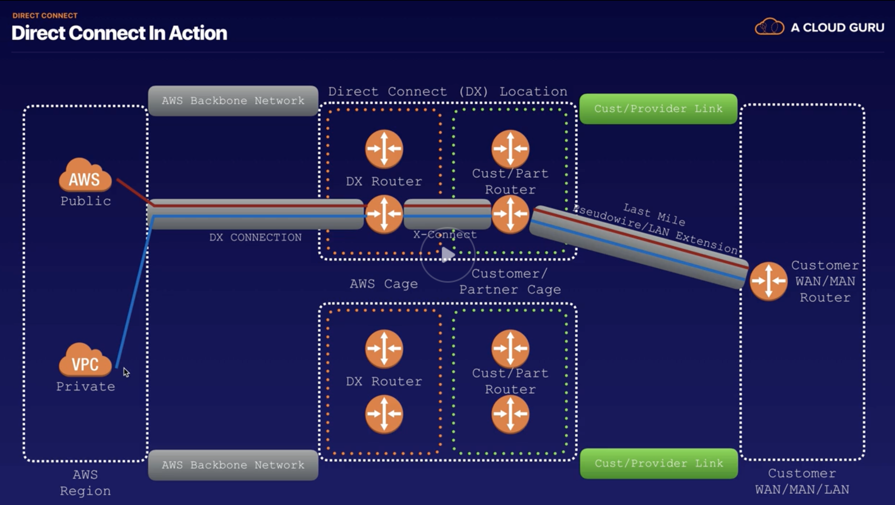
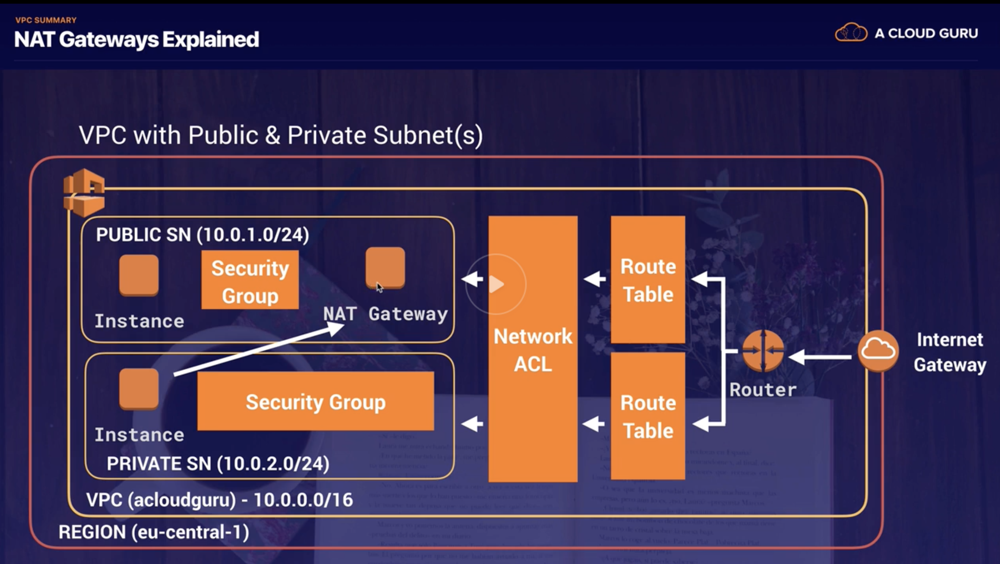

# VPC

- VPCs per Region
  - 5
  - Subnets per VPC
    - 200
- private addresses
  - 10.0.0.0 - 10.255.255.255 (10/8 prefix)
  - 172.16.0.0 - 172.31.255.255 (172. 16/12 prefix)
  - 192.168.0.0 - 192.168.255.255 (192.168/16 prefix)
  - CIDR (Classless Inter-Domain Routing)
    - refer to [here](http://cidr.xyz/)
  - netmask /28 is the minumum in AWS

- VPC Peering
  - allows you to connect one VPC with another via a direct network route using private IP addresses
  - Instances behave as if they were on the same private network
  - can peer VPC's with other AWS accounts as well as the other VPCs in the same account
  - Peering is in a star configuration: ie. 1 central VPC peers with 4 others. No transitive peering!!!
  - Can peer between regions

## Create a VPC

- pricing about VPC
  - From [here](https://aws.amazon.com/blogs/aws/new-managed-nat-network-address-translation-gateway-for-aws/)
- create a new VPC
  - CIDR: 10.0.0.0/16
  - creating a VPC will not add subnet automatical
  - will add a new route tables
  - will add a new ACL
  - will add a Security Group
- create a subnet
  - select an AZ e.g. us-east-1a
  - assign a CIDR block
    - 10.0.1.0/24
  - create another subnet
    - select an AZ e.g. us-east-1b
    - 10.0.2.0/24
  - After creating, will see 251 available IP, becasue AWS reserved 5 IPs
    - 10.0.0.0 - 10.0.0.3
    - 10.0.0.255
  - make one public accessible
    - modify auto-assign IP settings to enable auto-assign
- config Internet Gateway
  - create a internet gateway
  - attach it to the VPC (one Internet Gateway can only attach to one VPC)
- config route table
  - create a route table
  - edit routes
    - create a public routes
      - 0.0.0.0/0
      - target, select a Internet Gateway
      - add subnet associations
  - the public one should have a public IP and should be able to ssh into it
- create 2 EC2
  - create the public one
    - select the new VPC and the public subnet
  - create another private one
- now, my public server can still not ssh into my private one, becasue their security groups are not allowed ssh yet
  - create a new security group to allow 10.0.1.0/24
    - All ICMP
    - HTTP
    - HTTPS
    - SSH
    - MySQL/Aurora
  - update the new security group to the private EC2
  - new it should be able to ping to the private EC2 from the public one
  - add pem and chomod and ssh to the private EC2
  - now the private EC2 can't do yum update -y because it's totally separate from the internet
- NAT Instance and NAT Gateway
  - create an instance, go to community AMIs
    - search NAT and select the first one
    - select the new VPC and the public subnet
      - [About NAT and AWS config](https://docs.aws.amazon.com/vpc/latest/userguide/VPC_NAT_Instance.html)
      - Disable source/destination check (NAT must have the use other sources, which will not pass the check, chech the link above)
  - add the NAV instance to route table
    - edit routes
      - 0.0.0.0/0
      - target: i-xxx new nat instance
  - now login from the public EC2
    - sudo su
    - ssh ec2-user@private-ec2 -i xx.pem
    - sudo update -y (couldn't install in my lab)
  - This way is not scalable, because the NAT server is easy to become to the bottle nack
    - This way: Nat instance is totally out-dated, but still may exist in the exam
  - now, create a NAT Gateway
    - select the public subnet
    - add a new elastic IP
  - Edit route table, select the main one
    - 0.0.0.0/0
    - target: nat-xxx the new NAT gateway
  - now it should be able to do yum update (it works in my lab)

## Network Access Control List

- create a new ACL
  - a new ACL will default deny everything
    - the vpc has a default ACL, the default ACL has public access
  - add sub association to the public subnet, the IP should not be accessable now
    - this change will also table the public subnet out of the default ACL
    - one ACL can associate to multiple subnets, one subnet can only associate to one ACL
  - now add three rules to the ACL
    - inbound 80. 443, 22
    - outbound 80, 443, 1024-65535 (Ephemeral prot)
  - now the IP should be accessable
  - if add a deny rule for my current IP (this must before the 0.0.0.0/0 rule), my IP should be deny access
  - request will hit ACL first and then hit to the security group
  - ACL is stateless

## Custom VPCs and ELBs

- create an application load balancer (HTTP)
  - select the VPC
  - select a public subnet
    - will throw an error at least two subnet is required

## VPC Flow logs

- a flow log is a feature that capture information about the IP traffic going to and from network interfaces in VPC
- flow log data is stored using CloudWatch / S3
- 3 levels
  - Network Interface Level
  - VPC
  - Subnet
- create a flow group
  - select the custom VPC and create flow log
  - inorder to add to CloudWatch, need to create a log group
  - create a flowlogsRole for the IAM

## a bastion host

- similar to Jump Boxes
- A NAT Gateway or NAT Instance is used to provide internet traffic to EC2 instances in a private subnets
- A bastion is used to securely admin EC2 instances (Using SSH or RDP)
- Can't use NAT Gateway as a Bastion host

## Direct Connect

- 
- connect my data center to AWS
- useful for high throughput workloads (ie lots of network traffic)
  useful if need a stable and reliable secure connection

## VPC Endpoint

- types
  - interface endpoints
    - point to services, for examples:
      - API Gateway
      - CloudFormation
      - CloudWatch
      - SNS
      - SQS
      - ...
  - gateway endpoints
    - S3
    - DynamoDB
- create a gateway endpoint
  - create a role for ec2 to access s3
  - add the role to the private ec2 which using the private subnet
  - now ssh to the public ec2 (can change the public subnet back to the default ACL for this VPC)
  - we can remove the NAT Gateway then the private ec2 can not talk to the internet
  - now create  endpoint and select us-east-1.s3
    - select the private vpc
    - select the main subnet
    - full access
  - now the private ec2 can do aws s3 ls
- Endpoints are virtual devices. They are horizontally scaled, redundant and highly available
- No need NAT, VPN or AWS Direct Connect connection

## Exam Tips

- high level overview
  - 
- Think a VPC as a logical datacenter in AWS
- Consists of IGWs (Or Virtual Private Gateways), Route Tables, Network Access Control Lists, Subnets and Security Groups
- 1 Subnet = 1 AZ
  - 1 Subnet will not stretch to other AZ
  - can have multiple subnets in the same AZ
- Security Groups are stateful, ACL (Network Access Control Lists) are Stateless
- No transitive peering
- For NAT instance
  - must disable source/destination check
  - NAT instance must be in the public subnet
  - must have a route out of the private subnet to the NAT instance
  - will be the bottlenecking
  - NAT instance is behind the security group
- For Nat Gateways
  - redundant inside the AZ
  - enterprise
  - scale automatically
    - starts at 5 Gbps to currently 450 Gbps
  - shoule associate to a public subnet
  - no need to patch
  - not associated with security groups
  - need to update the route tables
  - no need to disable source/destination check
  - should create each NAT Gateway in each AZ for the resources in that AZ
- ELB
  - need minimum of two public subnets to deploy an internet facing load balancer
- VPC flow logs
  - cannot tag a flow log
  - cannot enable flow logs for VPCs that peered with your VPC unless the peer VPC is in your account
  - After create a flow log, cannot change its configuration
  - not all IP traffic is monitored
    - no: traffic generated by instances when they conntact the Amazon DNS server
      - if you use your own DNS server, then all traffic to that DNS server is logged
    - no: traffic generated by a Windows instance for Amazon Windows license activation
    - no: traffic to and from 169.254.169.254
    - no: DHCP traffic
    - no: traffic to a reserved IP address for the default VPC router
- Endpoints
  - types
    - interface
    - gateway
      - s3
      - dynamodb
  - not leave AWS network
- An egress-only Internet gateway is a horizontally scaled, redundant, and highly available VPC component that allows outbound communication over IPv6 from instances in your VPC to the Internet, and prevents the Internet from initiating an IPv6 connection with your instances.
  - An egress-only Internet gateway is for use with IPv6 traffic only. To enable outbound-only Internet communication over IPv4, use a NAT gateway instead.

## Exam Review

- What is the purpose of an Egress-Only Internet Gateway?
  - Prevents IPv6 based Internet resources initiating a connection into a VPC
  - Allows VPC based IPv6 traffic to communicate to the Internet

- Which of the following are true for Security Groups? (Choose 3)
  - Security Groups evaluate all rules before deciding whether to allow traffic.
  - ecurity Groups operate at the instance level.
  - Security Groups support "allow" rules only.
    - Not in number order decision (it's ACL)

- A VPN connection consists of which of the following components? (Choose 2)
  - Virtual Private Gateway
  - Customer Gateway

- When I create a new security group, all outbound traffic is allowed by default.
  - True

- By default, instances in new subnets in a custom VPC can communicate with each other across Availability Zones.
  - True

- Are you permitted to conduct your own vulnerability scans on your own VPC without alerting AWS first?
  - Depends on the type of scan and the service being scanned. Some scans can be performed without alerting AWS, some require you to alert.
