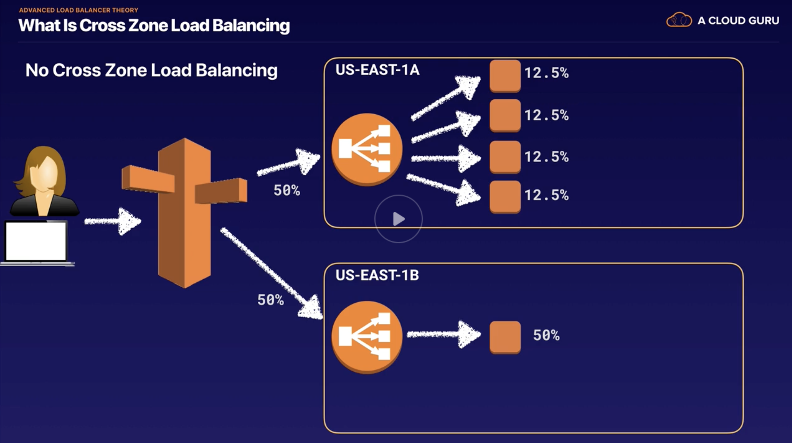
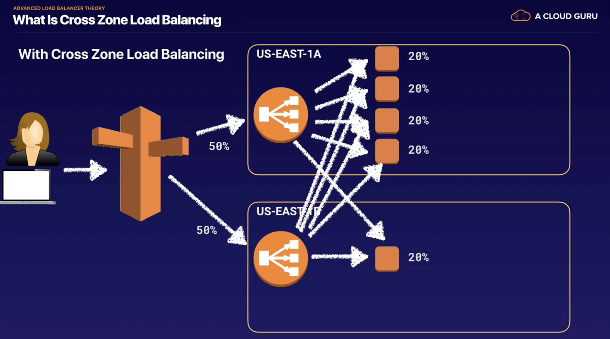
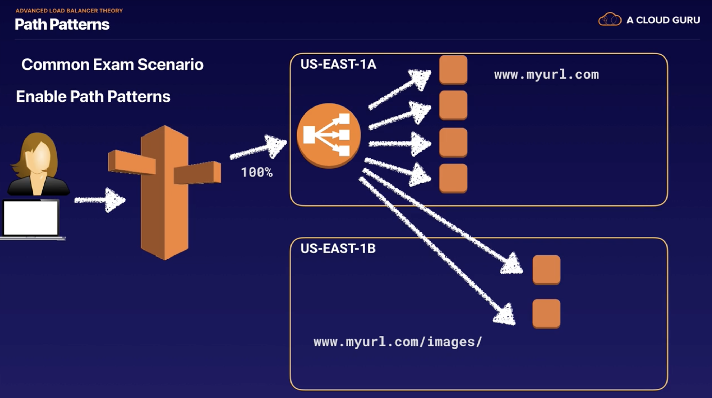

# Elastic Load Balancer

## Load Balancer

- types
  - Application Load Balancer
    - best suit for HTTP and HTTPS
    - operate at 7th layer
    - can create advanced request routing, sending specified requests to specific web servers
  - Network Load Balancer
    - best suit for TCP traffic where extreme performance is required
    - operate at 4th layer
    - capable of handling millions of requests per second and ultra-low latencies
  - Classic Load Balancer
    - HTTP and HTTPS
    - 7th or 4th layer
    - cheaper
    - if my app stops responding, the ELB responds with a 504 error, it means the application issue
      - it could be the web server or database
- X-Forwarded-For Header
  - for example
    - user at 123.1.2.3 -> loader balancer (10.0.0.23) -> one of the internal servers (10.0.0.26)
    - if the server want to know which is the user's IP, can refer to X-Forward-For to get the IP 123.1.2.3
- lab
  - create 2 ec2 in two AZs
  - create a classic load balancer
    - after creation, will get a DNS name, will not get an IP adress
    - now if I visit the DNS, I will see different server information when refresh
    - now if I shut down one server, load balancer will detect that
  - create am application load balancer
    - create a target group
    - add targets into the target group (add the 2 ec2s)
    - create an application load balancer
    - go to target gourps add 2 ec2s as registered
    - if I go to the load balancer and the lister page, I will see more configurations there, that's why it's smarter

## Advanced topics

- sticky sessions
  - Classic load balancer routes each request independently to the registered EC2 instance
  - Sticky sessions allow to bind a user's session to a specific EC2 instance
  - can enable sticky sessions for application load balancer, it's on the target group level
    - also, if I found that load balaner is not change the route, I could consider disable sticky sessions

- no cross zone load balancing
  - 
  - 

- Path patterns
  - forward requests based on the URL path (path-based routing)
  - 

## Auto Scaling

- Using Auto Scaling Group based on schedule
  - in response to predictable load changes
- launch configuration
  - add bootstrap script and security group
  - select use scaling policy
  - select 3 instance and scale to 6
  - terminate 2 instances
  - after sometime, I can see new two instances are auto create

## HA Design Priciples

- plan for failure
- requires a minimum of 6 instances and it must be highly available
- must be able to tolerate the failure of 1 AZ
- What is the ideal architecture for this environment while also being the most cost effective?
  - 3 AZs with 3 instances in each AZ
    - If lost one, at least still have 6 instances
