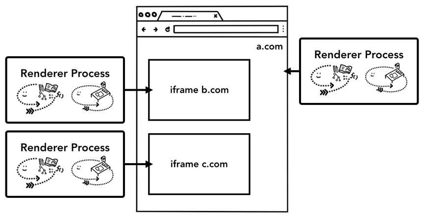

# Part 1
Excuting program on Process and Thread

## Process
- Process can ask the OS to spin up another process
- Two processed talk by Inter Process Communication (IPC)

## Browser Architecture

- Renderer Process
  - Multi-processes are created for each tab, including iframes
  - controls every thing in a tab

- Browser Process
  - controls chromse: address bar, bookmarks, back and forward buttons
  - network requests and file access

- Plugin Process
  - plugins

- GPU
  - Handles GPU tasks in isolation from other processes

- Network Process
- UI Process
- Storage Process
- GPU Process
- Device Process
- ...

## Benefit
- Performance
- Independent
- Security and sandboxing
  - sandbox certain processes from certain features, restrict by processes' privileges
  - e.g. Restricts arbitrary file access for processes that handle arbitrary user input like render process
- They have own private space, share copies of common infrastructure, like V8

## Side Isolation
- separate renderer process for each cross-site iframe

