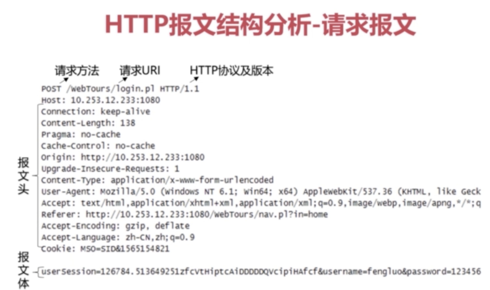
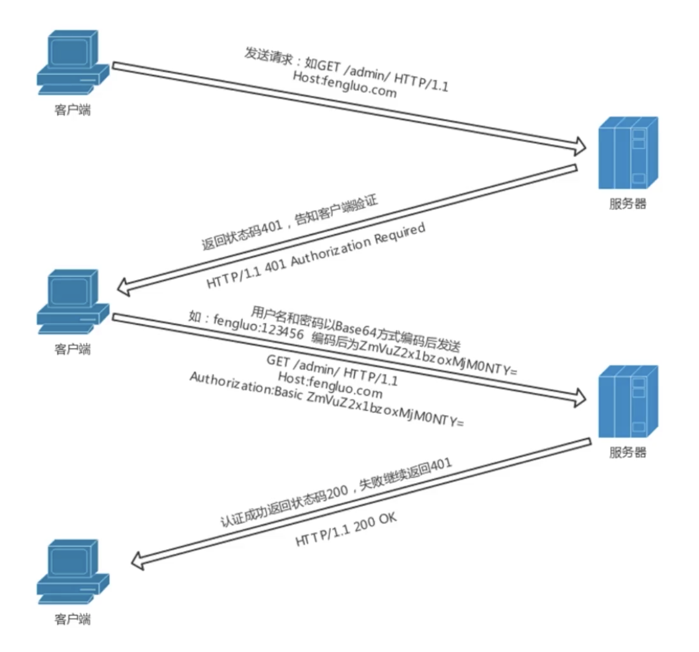
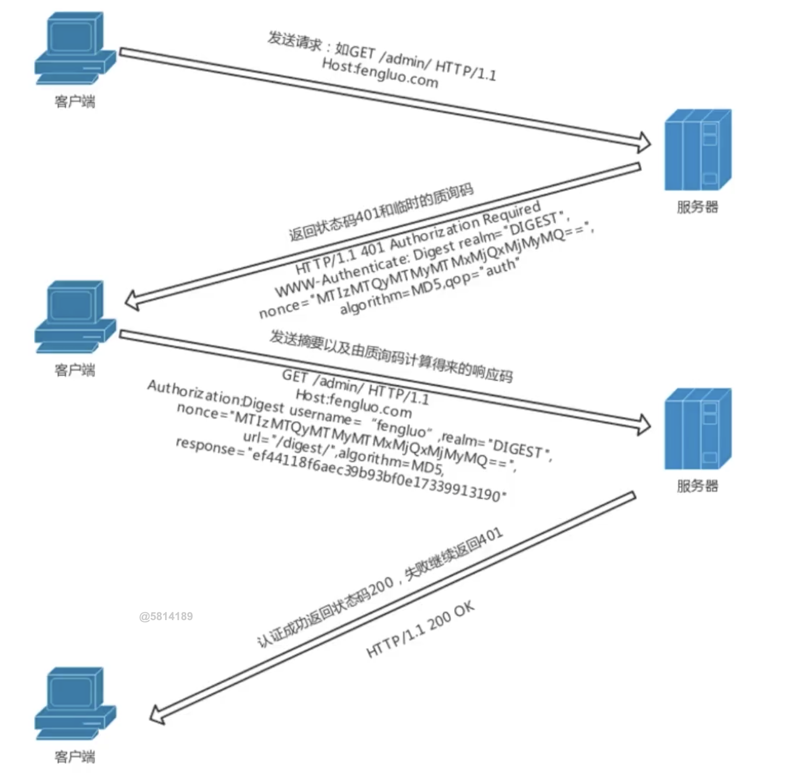
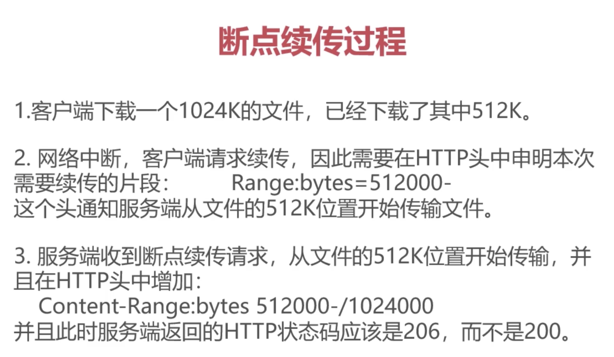

# HTTP

## 报文

- HTTP 报文结构分析 - 请求报文

  

- 报文头
  - 通用报文头
    - Cache-Control
    - Connection
    - Date
    - Pragma
    - Trailer
    - Transfer-Encoding
    - Upgrade
    - Via
    - Warning
  - 请求专业
    - Accept
    - Accept-Charset
    - Accept-Encoding
    - Accept-Language
    - Authorization
    - Expect
    - From
    - Host
    - If-Match
    - If-Modified-Since
    - If-None-Match
    - If-Range
    - If-Unmodified-Since
    - Max-Forwards
    - Proxy-Authorization
    - Range
    - Referer
    - TE
    - User-Agent
  - 响应报文头
    - Accept-Ranges
    - Age
    - ETag
    - Location
    - Proxy-Authenticate
    - Retry-After
    - Server
    - Vary
    - WWW-Authenticate
  - 实体报文头
    - Allow
    - Content-Encoding
    - Content-Languate
    - Contnet-Length
    - Content-Location
    - Content-MD5
    - Content-Range
    - Content-Type
    - Expires
    - Last-Modified

- 常用报文
  - Accept
    - 客户端可以接受的返回类型，比如 text/html, 如果服务器没法返回，可能会得到 406 Non Acceptable
    - Accept: */* 任何类型
    - 可以设置优先级
  - Accept-Encoding
    - gzip, deflate
  - Accept-Language
    - Accept-Languate: zh-en, zh; q=0.7,en-us,en;q=0.3
  - Connection
    - Connection: keep-alive
    - Connection: close
  - Host
    - 指定被请求资源的 Internet 主机和端口号，通常来自 HTTP URL
    - www.google.com:80
  - Referer
    - 告诉是从哪个页面进来的
  - User-Agent
    - 比如：跟进浏览器类型返回不同的内容做兼容
  - Content-Type

## 请求方法

- 常用方法
  - GET
  - POST 创建资源
  - PUT 幂等性，缺少验证机制，通常被 POST 替代
  - DELETE 也是缺少验证机制
  - HEAD 经常用来判断链接的有效性
  - OPTIONS 返回支持的方法
  - TRACE 回显服务器收到的请求，主要用于测试或诊断
  - CONNECT 开启双向沟通的通道，通常用于 VPN, 客户端和服务器建立 connect 之后进行代理

## 状态管理

- Cookie and Session
  - Cookie and Session 区别
    - 存放位置不同
    - Session 更安全，或者将 Cookie 加密也能保证安全
    - 有效期的不同
    - 对服务器的压力不同，Session 需要更多的资源
  - Session
    - 保存 Session ID 的方式
      - Cookie
      - URL 重写
      - 隐藏表单
    - Session 的有效期
      - 超时
      - 通过程序调用

## 深度理解技术细节

### 字符集与编码

- 编码规范
  - 字库表，字符集，编码方式
    - 字库表，字符的数据库
    - 字符集，存储的二进制，可以映射到字符
    - 编码方式，这些二进制通过算法压缩，比如 unicode, utf-8
  - 常见编码方式
    - ASCII
    - GBK
    - ISO-8859-1
    - Unicode
  - URL 的编码
    - 对 URL 中属于 ASCII 字符集的非保留字不编码
    - 保留字需要去其 ASCII 内码，然后加上 % 前缀
    - 非 ASCII 字符需取 Unicode 内码，然后加 % 前缀

### HTTP 协议：身份认证

- 认证方式
  - Basic 认证
    - 不加密，发送明文
    

  - Digest
    

  - SSL 客户端认证
  - 基于表单的认证

### HTTP 长短链接

- HTTP/1.1 起，默认采用的是长连接
  - 实现方式
    - Response Headers -> Connection: keep-alive
  - 需要客户端和服务端都支持长连接

### HTTP 代理

- Web 客户端 -> Web Proxy -> Web Server
- 应用
  - 抓包
  - 翻墙
    - 注意，代理和 VPN 是不同的技术，VPN 是使用的 Tunnel
  - 匿名访问
    - 比如隐藏原始用户的 IP 地址和一些信息
  - 过滤器
    - 拦截部分请求

### HTTP 网关

- 用处
  - 网关映射了到达资源的方法，网关是资源和应用之间的粘合剂
- 常见的网关
  - HTTP/*
  - HTTP/HTTPS
  - HTTPS/HTTP
  - 资源网关

### HTTP缓存

- 如果返回 304 Not Modified，将使用缓存
- 缓存控制：Cache-Control
  - no-store   所有内容都不缓存
  - no-cache   缓存，但是会判断资源是否更新
  - max-age    x 秒内不再发送请求
  - s-maxage   代理服务器 x 秒内不再发送请求，支队 CDN 缓存有效
  - public     客户端和代理服务器(CDN)都可缓存
  - private    只有客户端可以缓存
  - expires    优先级低于 max-age, 服务器告诉浏览器多久再去请求
  - if-Modified-Since  浏览器告诉服务器，和 Last-Modifed 是一对
  - Etag       资源标识
  - if-None-Match 缓存资源标识，浏览器告诉无服务器上次的 Etag, 它们会进行比较

- 应用场景
  - 服务器返回浏览器带上 expires，告诉这段时间不在请求
    - 这样做的缺点是无法判断文件是否修改，如果没有修改，expires 之后还是会返回同样的
  - 除了 expires。服务器给一个 last-modified。
    - 浏览器再次请求要带上 last-modified-since 去和服务器比对
  - 再增加一个 Etag 与 If-None-Match。再加一个 max-age。
- 缓存改进方案
  - 为静态文件加 MD5 或者 Hash 标识
  - CDN 缓存

### 内容协商机制

- 内容协商方式
  - 客户端驱动
    - 比如客户自己选择语言版本
  - 服务器驱动
    - 服务器跟进请求判断, 也可以设置权重
      - Accept
      - Accept-Language
      - Accept-Charset
      - Accept-Encoding
    - 举例：Accept-Languate: en;q=0.5, fr:q=0.0, nl:q=1.0, tr:q=0.0

### 断点续传和多线程下载

- Range
  - 指定第一个和最后一个字节的位置, 如：Range:(unit=first byte pos)-[last byte pos]
    - Range: bytes=0-499
    - Range: bytes=500-
    - Range: bytes=500-600,601-999
- Content-Range
  - response 收到 Range 之后，服务器在 Content-Range 头部返回当前接受的范围和文件总大小
    - Content-Range: bytes (unit first byte pos) - [last byte pos]/[entity length]
      - 返回 200 不使用断点续传
      - 返回 206 Partial Content 使用断点续传
- 断点续传的过程
  
