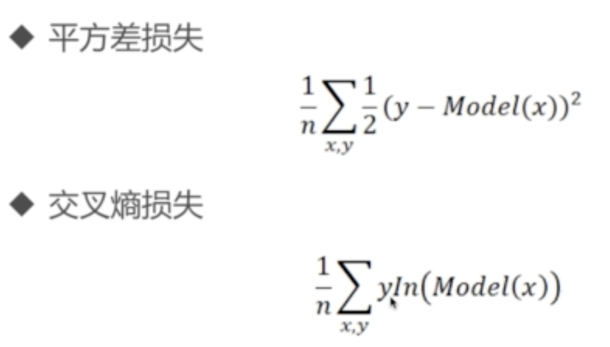

# keras

## 分类与回归

- 分类，预测类别，输出是概率分布
  - [0.2, 0.7, 0.1]
- 回归，预测值
  - 比如预测房价
- 目标函数
  - 分类问题
    - 三分类例子 [0.2, 0.7, 0.1]
    - one_hot > [0,   1,   0] (把离散值变化为分布)
  - One-hot 把正整数变为向量表达

## 目标函数两种算法

