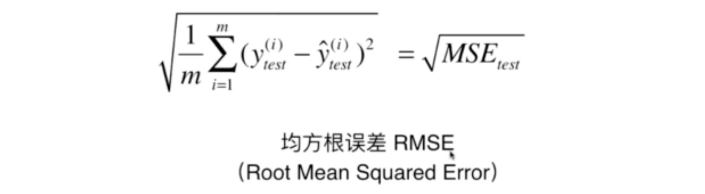

# Linear Regression

## 简单线性回归

### 5.1 - 5.3 最优化目标函数和简单线性回归

- 求误差的 loss function
  - 目标就是让预测值 y 的方差达到最小

  - 还有一种方法是求拟合度 (fitting) 的 utility function

- 使用最小二乘法求目标函数的最小值

  - 求导的过程
  
  

### 5.4 向量化运算

- 整理成这样的公式，更加适合向量化运算。向量化运算可以使用点乘的方式，在 numpy 中进行了优化

### 5.5 衡量线性回归法的指标：MSE, RMSE 和 MAE

- 均方误差 MSE (Mean Square Error)

- 均方根误差 RMSE (Root Mean Square Error)

- 平均绝对误差 MAE (Mean Absolute Error)

### 5.6 最好的衡量线性回归法的指标 R Squared

- 思考 kNN 的预测，我们会得到 1 最好，0 最差。我们无法衡量一个预测的准确度。比如：房产预测的误差为 5 万元，学习成绩误差为 50 分。这没法知道哪个预测的更准确。

- R Squred 的原理
  - 分母采用 base model, 会产生很大的误差，我们的算法也会产生误差。如果使分子足够小，整体的误差就会越小
  
  - 特征
  
- 相当于把回归问题的衡量指标映射到了 0 - 1 之间，1 为最好， 0 为最差
- 简化

