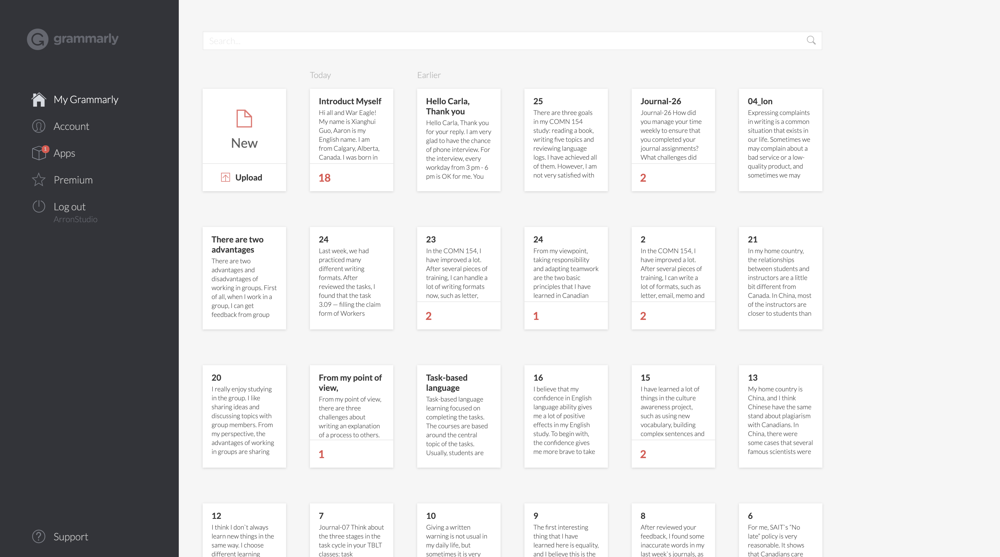

## Fluid content and fixed fotter

  - It's using a fixed height, but the content view extends out. A fixed footer shows up if there are grammar issues.
  - By this way, we have a fixed card and meanwhile, we show the additional views based different items.
