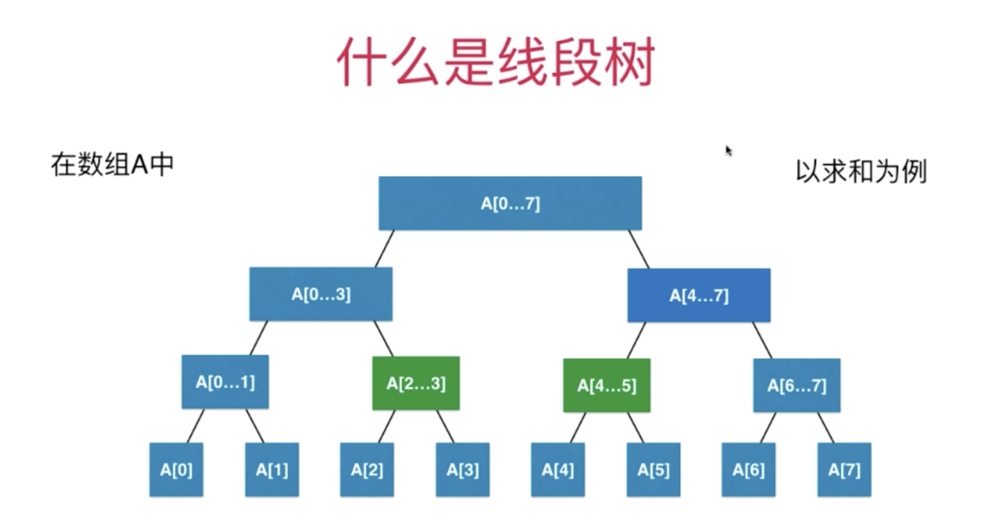
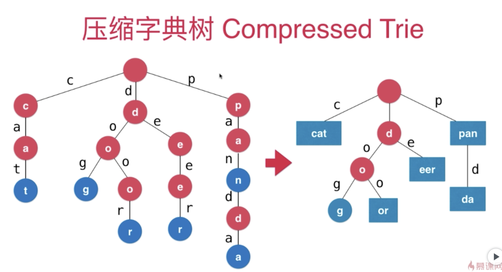
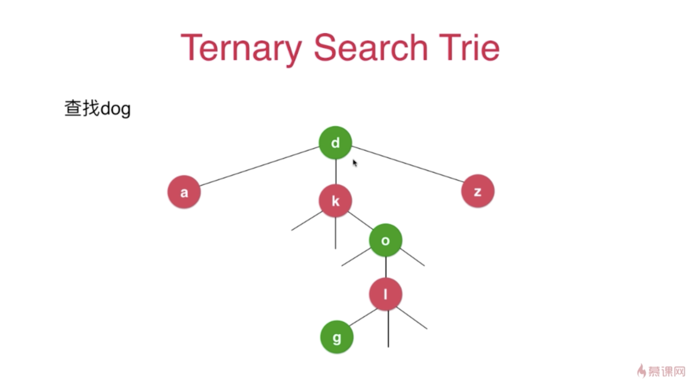
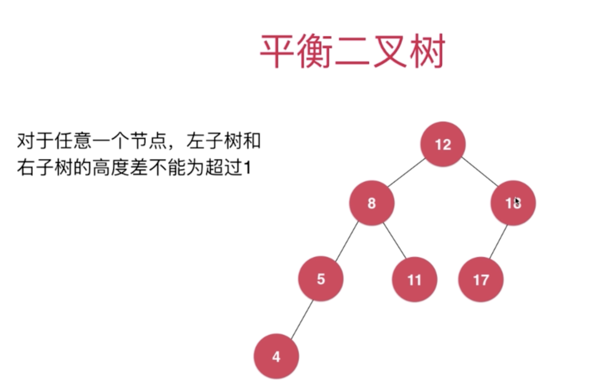
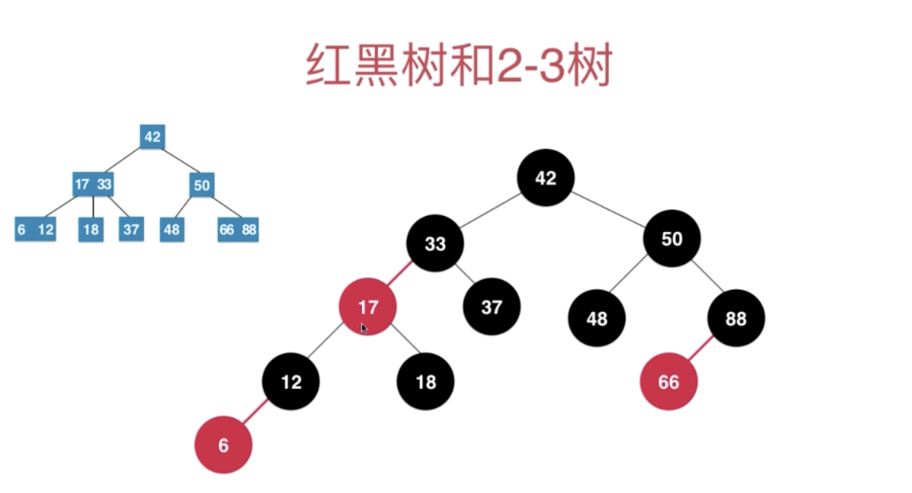

# Data Structures

## Summary

- 数据结构的分类
  - 线性
    - dynamic array, queue, stack, linked list
    - hashtable (本身就是一个数组，也可以实现的比较复杂)
  - 树
    - binary search tree, avl, red and black tree
    - heap, line tree, trie（也可以用数组）, quickfind
  - 图
    - 邻接表，邻接矩阵
- Real life examples
  - Database
    - tree: AVL, 红黑树，Treap, 伸展树，B 树
    - hashtable
  - 操作系统
    - stack
      - 系统栈，函数的循环调用
    - heap
      - 优先队列
  - 文件压缩
    - 哈弗曼树(比较简单的算法)
  - 通讯录
    - trie - 前缀树
  - 游戏
    - 寻路算法
      - DFS 深度优先
      - BFS 广度优先

### 学习的注意事项

- C++, Java 更适合查看性能，因为脚本语言有一些语法上的优化

```python

# 后者性能更加优化

arr1 = []
for i in range(10)
  arr1.append(i)

arr2 = [i for i in range(10)]

```

## 02 Array

### 时间复杂度的定义

- 大 O 描述的是算法的运行时间和输入数据之间的关系
  - 渐进时间复杂度，描述 n 趋近于无穷的情况
- O(1)
  - 与数据的规模无关
- 均摊复杂度和防止复杂度的震荡
  - 均摊复杂度 (amortized time complexity)
    - 比如 resize, 每十次才调用一次
  - 复杂度震荡
    - 比如在 capacity = size - 1 时，一直运行 addLast and removeLast, 每次才做都要扩容
    - 出现这个问题的原因
      - removeLast 后 resize 过于着急 (too eager)
    - 解决方案
      - lazy
        - 当 size == capacity / 4 时，才将 capacity 减半

## 03 Stack and Queue

- 栈的应用
  - 撤销的实现
  - 系统调用的系统栈
  - 递归
  - 括号匹配 - 编译器
- 队列
  - 使用循环队列来提高 dequeue 的性能
    - front == tail 队列为空
    - （tail + 1） % c == font 队列为满

## 04 链表 Linked List

- 链表，真正的动态数组
  - 之前实现的动态数组，包括扩展的 stack 和 queue，都是底层依托了静态数组实现的
  - 链表是最简单的动态数据结构
  - 需要更深入的理解引用（指针）
  - 需要更深入的理解递归
  - 辅助其他的数据结构
- 链表的缺点
  - 丧失了随机访问的能力
  - 链表不适合用于索引有语义的情况
- 链表的 dummyHead 虚拟头节点
  - 避免 addFirst 时候需要特殊处理
  - 因为链表的特性，只操作数据头会更高效
    - 也可以用链表实现 stack
  - 用链表实现 queue, 可以添加 tail 的标记来优化性能

## 05 链表与递归

- 代码存放在 04 章节里面
- 递归
  - 递归的思想可以概况为：把原本的大问题拆分的更小，循环到最基本的问题
- 链表的其他形式
  - 双链表
  - 循环链表 ( Java 的链表就是使用了循环双向链表 )
  - 数组链表 ( 自带索引 )

## 06 二分搜索树 ( Binary Search Tree )

- 树的存储非常高效
  - Binary Search Tree
  - 平衡二叉树: AVL, 红黑树
  - 堆; 并查集
  - 线段树; Trie ( 字典树，前缀树 )

### 二分搜索树

- 二叉树
  - 和链表一样，动态数据结构
  - 每个节点最多有两个孩子
  - 可能只有一个节点
  - 天然递归
- 二分搜索树
  - 每个节点的值，都要大于其左子树的值
  - 每个节点的值，都要小于其右子树的值
  - 我们实现的二分搜索树，不包含重负元素( 这个不是硬性要求 )
  - 二分搜索树是有序的，可以轻易拿到后继和前驱 successor， predecessor
  - 可以维护 size 和 depth 在二分搜索树，也可以支持重复元素的二分搜索树
  - 重复元素的二分搜索树也可以通过加入 count 来实现计数

```java
class Node {
  E e;
  Node left;
  Node right;
}
```

## 07 Set and Map

一个值得注意的一点，Set and Map 都可以通过定义接口来实现应用，而底层的实现则可以不同。比如之前用 Array 和 Linked List 实现了 Stack 和 Queue 的功能。实现的方式其实是多种多样的。

### Set

- 特点
  - Unique element
  - 因为不可重复，所以 Binary Search Tree 是很好的实现方式
- 应用
  - 用户访问次数，需要去掉重复的用户
  - 广告点击率，需要去掉重复的 IP
  - 词汇量的统计，去掉重复的单词
- 使用 BSTSet 和 LinkedListSet 在性能上有巨大的差异
  - 原因
    - add, contains, remove
      - 链表为了去重，还要检查是否存在当前的元素，所以是 O(n)
      - 搜索树的话，每次都是减去一半，最高的遍历是树的高度（深度 h）O(h)
      - 树有 2^h - 1 个节点
      - h 和 n 的关系：每层有 2^(h - 1) 个元素
        - n = 2^0 + 2^1 + ... + 2^h-1
          - 等比数列求和：n = 2^h - 1
          - h = log2(n + 1) = O(log2n) 的复杂度 (log 级别的关系) -> O(logn)
      - 需要注意，如果数据近乎有序的话，BSF 可能退化成链表
        - 解决这个问题，可以通过创建平衡二叉树

### Map

- 用 Binary Search Tree 实现的 Map 会大大好于用 LinkedList 实现的映射
- 有序映射
  - 通常基于树去实现
- 和无序映射
  - 通常通过 HashTable 实现
  - 链表也可以，但是太慢
- 多重映射
  - key 可以重复

### Heap

- 特性
  - 二叉堆是一颗完全二叉树
  - 父亲节点大于等于子节点，最大堆，相反就是最小堆
  - heap 可以使用一个数组存储
    - 当 index 为 0
      - i 的 parent: (i-1)/2
      - i 的 left: i * 2 + 1
      - i 的 right: i * 2 + 2
  - 完全二叉树不会退化为链表
- 广义的堆和队列
  - d 差堆 d-ary heap
  - 索引堆
  - 二项堆
  - 斐波那契堆
  - 栈也可以理解成是一个队列

### Line Tree

- 什么是线段树

  

- 特点
  - 线段树不一定是完全二叉树
  - 线段树是平衡二叉树（最大深度和最小深度相差不超过 1）
    - 完全二叉树一定是平衡二叉树
    - 不会退化成为链表
  - 如果区间有 n 个元素，数字表示需要有多少节点？
    - 对于 tree, 它有 n = 2^h - 1 个节点，近似于 2^h
      - 那么 n = 2^h, 线段树的一个特点是，叶子节点的总和等于所有的父亲节点的总和
    - 当 n = 2^k （2 的整数次幂） 的时候，2n 的容量可以满足这个线段树（会富余出一个节点）
    - 当 n = 2^k + 1 (基数), 则需要 4n，会有一些节点富余，非满二叉树的时候，可能很多的空间会是空的
  - 一半线段树不考虑动态，会固定一个区间
- 懒惰更新
  - 如果需要对线段树做一个区间的更新，找到区间后要去更新父节点和子节点，操作比较耗时
    - 一个优化的方式是，可以采用 lazy update。更新了区间和父节点之后，缓存更新的内容到一个数组中，等下次有其他的遍历之后再去更新
- 二维线段树
  - 可以把矩阵作为 root, 甚至是多维的
- 动态线段树
  - 可以创建链式的动态线段树
- 区间操作相关的另一个重要数据结构
  - 树状数组：Binary Index Tree
- 区间的其他解决方案
  - RMQ: Range Mimimum Query

### Trie 字典树

- 定义
  - 每个节点有 26 个指向下个节点的指针
  - 如果要大小写，或者存在其他字符，会需要若干个节点
  - 每个节点应该有个 isWord 因为不一定只有叶子节点能够构成一个 word
- Trie with Map 也可以做词频统计的功能
- Trie 的局限性
  - 最大的问题是空间
- Trie 的扩展
  - 压缩字典树 Compressed Trie 可以把独立的子节点放到一个节点，解决占用空间大的问题

    

  - Ternay Search Trie
    - 节省更多的空间

    
  - 后缀树
- 更多字符串的问题
  - 子串查询的算法
    - KMP
    - Boyer-Moore
    - Rabin-Karp
  - 文件压缩
    - 霍夫曼算法
  - 模式匹配
    - 正则表达式
  - 编译原理
  - 生物科学
    - DNA 就是一个巨大的字符串

### 并查集

- 孩子链接父亲
  - 可以高效的回答：连接问题
  - 并查集可以非常快的检查网络中节点间的连接状态，社交网络
  - 求集合的并集

### 平衡树和 AVL

- AVL 树（名称来自于创建人的名字字母组合）
  - AVL 维持相对的平衡，因为二叉树可能会退化到链表
  - 最早的可以自平衡的二叉树
- 定义
  - 对于任意一个节点，左子树和右子树的高度差不能超过 1 （注意，这里的定义和堆以及线段树是有区别的）

    

### 红黑树与 2-3 Tree

- 2-3 Tree
  - 2-3 Tree 是一棵绝对平衡的树
- 红黑树
  - 等价于 2-3 tree
  - 红色一定是向左倾斜的
    

### Hash Table

- 哈希表数据结构要解决
  - 哈希函数的设计
  - 哈希冲突
  - “键” 通过哈希函数得到的 “索引” 分布越均匀越好
    - 这个问题非常复杂，有专门的论文讨论不同领域的问题
- 哈希函数的设计
  - 整形
    - 小范围的正整数直接使用
    - 小范围负整数进行偏移
    - 大整数
      - 通常：取模
        - 比如取身份证的后四位
        - 如果去后六位，因为前两位是生日，1 - 31，其他的数字用不上，会造成分布不均匀
  - 浮点型
    - 浮点数传化成整形
  - 字符串
    - 转成整形处理
      - 比如 26 个字母使用 26 进制的方式存, 比如 code (B 代表自定义的进制)
        - hash(code) = (c*B^3 + o*B^2 + d*B^1 + e*B^0) % M
        - 可以简化为：hash(code) = ((((c*B) + o)*B + d)*B + e) % M
        - 可以简化为：hash(code) = ((((c % M)*B) + o) % M*B + d) % M*B + e) % M (每次都取模，避免整形益处)

          ```java
            // java 实现字母 hash 的示例
            int hash = 0
            for (int i = 0; i < s.length; i++)
              hash = (hash * B + s.charAt(i)) % M
          ```

  - 尽可能摸一个素数可以降低冲突的概率
- 原则
  - 一致性，if a = b, hash(a) == hash(b)
  - 高效性
  - 均匀性
