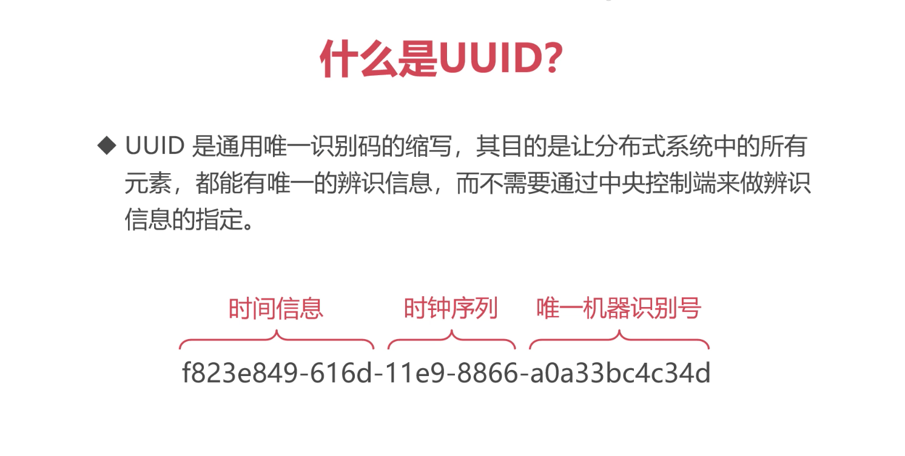

# 04 - New Retail Data Structures Design

## 01 - 02 - What is SPU and SKU

- Challege
  - e commerce website has products, and each product has many different properties. It's really complex due to the varity.
- SPU (Standard Product Unit) 标准产品单位, describes the features of a product.
- Product vs commodity (产品 vs 商品)
  - product has the common features
  - commodity has the details of a product, e.g. 16GB, 32GB, 64GB
- SKU (Stock Keeping Unit) 库存进出计量的单位，SKU 是物理上不可分割的最小存货单元
- Weighting and SKU
  - 为了避免商家随意修改商品的 SKU 造成对消费者的侵害，套包会对修改的 SKU 做权重下降
  - B2C 的模式中不需要考虑这一点
- SKU and Properties
  - SKU 非常繁多，并且每种产品的属性有很大差别
  - 怎么设计?
    - Category 1 <-> n Properties
      - phone -> CPU, Memory, Size, Battery
    - Product 1 <-> 1 Category
    - Product 1 <-> n Commodities

## 03 - 04 Design tables

- In file: ./new-retail-db.sql

## 05 Getting Deeper

- Number or UUID for PK ?
  - UIDD
    - What is UUID ?

      

    - MySQL build-in UUID
      - try: select uuid();
    - Why use uuid
      - 数据库集群中，为了避免每个 MySQL 各自生成主键造成重复
    - Pro
      - Generating PK faster (in distributed system)
      - global unique
      - good when have multiple servers
    - Con
      - 16 bytes, need more space, int is 4 bytes and bigint is 8 bytes
      - query slow
      - UUID is not ordered, IO writing is more random (writing is slower than ordering data)
      - Can be really impact the performance
  - Auto Increment
    - int and bigint is faster
    - indexing is faster
    - IO is faster
  - How to avoid of duplicate PK ?
    - middleware
      - MyCat
        - can generate global unique PK
        - MyCat is single thread
  - Not recommand using UUID for PK

- Modify table structures online
  - caveat
    - Backup is important
    - Stop the service and update table, do this when the traffic is really low
  - the cons of alter table statement
    - lock the whole table, can not write and read
    - if rollback happens, it will take even more time
    - when data is very large, it will take long time
  - tools
    - percona's tool kit : Percona Toolkit
      - percona's MySQL database has a very good performance
      - [Learn more](https://blog.csdn.net/wsk1103/article/details/80960300)
      - pt-online-schema-change can finish online modification
    - how it achieves
      - when alter table structure
        - it will create a new table
        - it will sync old table live data to the new table
        - copy data from old to new
        - then delete the old table and replace it
    - install
      - yum install -y perl-DBI
      - yum install -y perl-DBD-mysql
      - yum install -y perl-IO-Socket-SSL
      - yum install -y perl-Digest-MD5
      - yum install -y perl-TermReadKey

<!-- https://coding.imooc.com/lesson/353.html#mid=26131 -->
