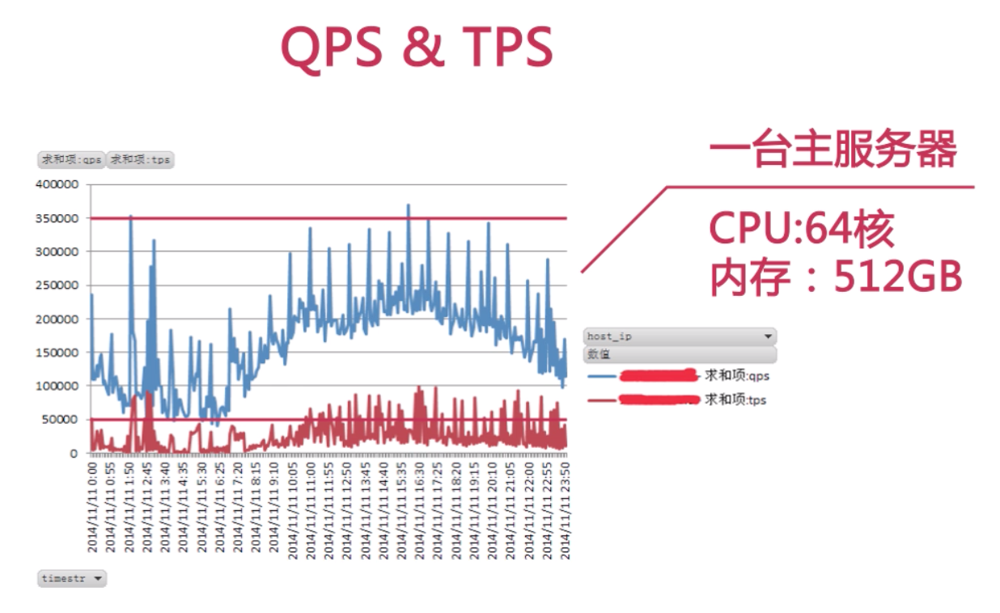

# 第一章 实例简介

## 比较常见的数据库架构
Master x 1  =>  Slave x n
- 如果一旦 master 遇到问题，必须从 slave 里面找出最新的提升为主服务器，并且要手动同步
- 因为 slave 众多，对网卡的压力也比较大

- TPS and QPS (blue is qps)

- Concurency and CUP

- Disk IO
  这里面体现的一个高峰是因为一个备份任务造成的，也说明，尽可能不要在主库上做备份，或者需要做高压力活动/促销的时候取消这样的计划

## 影响数据库性能的因素
- sql 查询速度 (慢查询是主要的性能瓶颈)
- 服务器硬件
- 网卡流量
- 磁盘 IO

### 大并发和超高 CUP 使用率
- 大并发造成数据库连接数被沾满
  MySQL 中由 max_connections 控制，默认 100
  注意，大并发和连接数不同，连接数很可能大大超过并发，因为很多连接是 sleep 状态

### 网卡流量
- 减少从服务器数量，因为需要复制数据，占用流量
- 进行分级缓存，避免前端大量的缓存失效会
- 避免 'select *' 查询，会返回很多不需要的数据
- 分离业务网络和服务器网络，避免服务器的事务影响数据库性能

### 大表和大事务
- 当一个表中记录超过1千万行，或者单表大于 10G，这是一个比较粗略的统计
- 大表对 DDL 有影响
  - 建立索引需要很长时间
  - MySQL < 5.5 会锁表
  - MySQL >= 5.5 引起主从延迟

### 如何处理大表
- 分库分表
- 大表的历史数据归档

### 大事务
- 什么是事务
  - 事务是数据库系统区别于其他一切文件系统的重要特性之一
  - 事务是一组原子性的 SQL 语句或独立工作单元

- 隔离级别
  - READ UNCOMMITTED
  - READ COMMITTED
    - default for Oracle, Sql Server and PostgreSQL
  - REPEATABLE READ
    - default for MySQL
    - 比如两个事务同时开启，第二个事务先提交，第一个事务在未提交前不会看到提交的数据
  - SERIALIZABLE
    - 应用到较多的锁，用的非常少

- 大事务
  - 锁太多，造成阻塞和锁超时
  - 回滚的时间比较长
  - 执行时间长，容易造成主从延迟

- 如何处理大数据
  - 避免一次处理太多的数据
  - 移除不必要的 select 操作