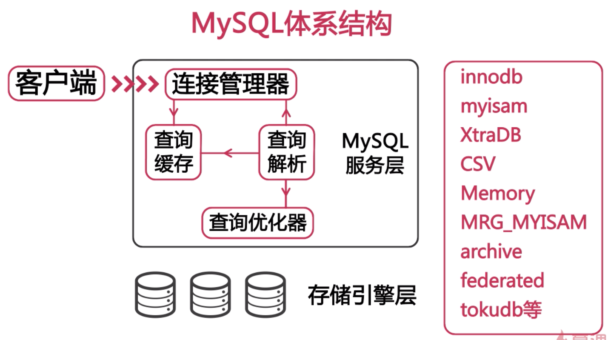

# 什么影响了 MySQL 的性能
- Hardware
- Server OS
- DB engine
  - MyISAM: 不支持事务，表级锁
  - InnoDB: 事务级存储引擎，完美支持行级锁，事务 ACID 特性
- DB config
- 数据库结构设计和 SQL 语句

## CUP 选择
- 我们的应用是 CPU 密集型的吗？
  - CPU 密集型，比如有复杂 SQL 的情况 - 需要更快的 CPU
  - 目前 MySQL 不支持多 CPU 对同一 SQL 并发处理
- 我们系统的并发量如何？
  - 并发高的话，多 CPU 的优势就体现出来了
  - MySQL 5.6 对多核有很好的支持，可以考虑 16 或 32 核的 CPU
- 注意，不要将 64 位的用在 32 位的系统上

## 内存
- 增加内存很好，但是如果当缓存的数据已经等于数据库的大小，增加内存就没有很大意义了
- 缓存对写也是有好处的，比如缓存可以将写入批量更新的数据库里面
  - 一个很好的例子就是电商网站里面的商品的浏览量计数器，如果每次都更新会对数据库造成很大的 IO 负担。可以缓存到一个计数器里面，当计数器达到一定的值之后再统一写入数据库
- 最好选择主板支持的最大内存频率
- 每个通道的内存：相同品牌，颗粒，频率，电压，校验技术和型号
- 单条容量尽可能大，大的内存可以批量写入，将随机 IO 优化为顺序 IO

## 磁盘
- 传统磁盘
  - RAID - Redunant Arrays of Independent Disks
    - RAID 0 - 串联
    - RAID 1 - 镜像
    - RAID 5 - 奇偶检验
    - RAID 10 - 分片镜像
- SSD 或 PCI-E SSD / Fashion IO
  -SSD
    - 更好的随机读写
    - 更好的并发
    - 容易损坏
    - 也支持 RAID
  - PCI-E
    - 性能更好
    - 会占用内存
- SAN， NAS 网络存储
  - 适合数据库备份

## 网络
- 带宽
- 网络质量 - 经常丢包
- 采用高性能高带宽的网络接口设备和交换机
- 对多个网卡进行绑定，增强可用性和带宽
- 尽可能进行网络隔离

## 操作系统
- CentOS 系统参数优化
  - 推荐阅读：Linux 性能优化大师
  - 内核相关参数

  ```bash
  # /etc/sysctl.conf
  # 网络相关参数
  # ————————————————————————————
  # 网络接口的监听队列，默认为
  net.core.somaxconn=65535
  net.core.netdev_max_backlog=65535
  net.ipv4.tcp_max_syn_backlog=65535

  # 加快 TCP 连接的回收
  net.ipv4.tcp_fin_timeout=10
  net.ipv4.tcp_tw_reuse=1
  net.ipv4.tcp_tw_recycle=1

  # TCP 连接缓冲区的最小和最大值
  net.core.wmem_default=87380
  net.core.wmem_max=16777216
  net.core.rmem_default=87380
  net.core.rmem_max=16777216

  # 加快 TCP keepalive 连接的回收
  net.ipv4.tcp_keepalive_time=120
  net.ipv4.tcp_keepalive_intvl=30
  net.ipv4.tcp_keepalive_probes=3


  # 内存相关参数
  # ————————————————————————————
  # Linux 内核参数中最重要的一个，用于定义单个共享内存段的最大值
  # 设置的足够大，以便能够在一个内存段下容纳整个 Innodb 缓冲池的大小
  kernel.shmmax=4294967295

  # 这个参数在内存不足是会对性能产生比较大的影响
  # 参数 0 意为：除非虚拟内存满了，否则不要交换区
  vm.swappiness=0


  # /etc/security/limit.conf
  # 增加资源限制 
  # ————————————————————————————
  * soft nofile 65535
  * hard nofile 65535

  # 磁盘调度策略
  # 查看当前策略
  cat /sys/block/sda/queue/scheduler
  noop anticipatory deadline [cfg] ...

  # 写入策略
  echo deadline > /sys/block/sda/queue/scheduler

  ```

## 文件系统
- Windows
  - FAT
  - NTFS - 服务器使用的
- Linux
  - EXT3
  - EXT4
  - XFS - 据说性能更高

```bash
# EXT3/4 系统挂在参数 /etc/fstab
# writeback 是最快的
data=writeback|ordered|journal

noatime, nodiratime

# 常见配置
/dev/sda1/ext4 noatime,nodiratime,data=writeback 1 1
```

## MySQL 的体系结构
- MySQL 的一大特点就是可以使用不同的存储引擎
- 存储引擎是针对表而不是库的，一个库中的不同表可以使用不同的存储引擎




## start from 2-12


